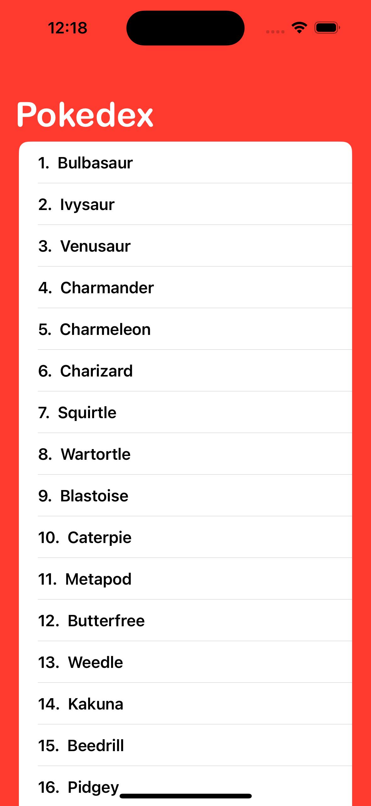
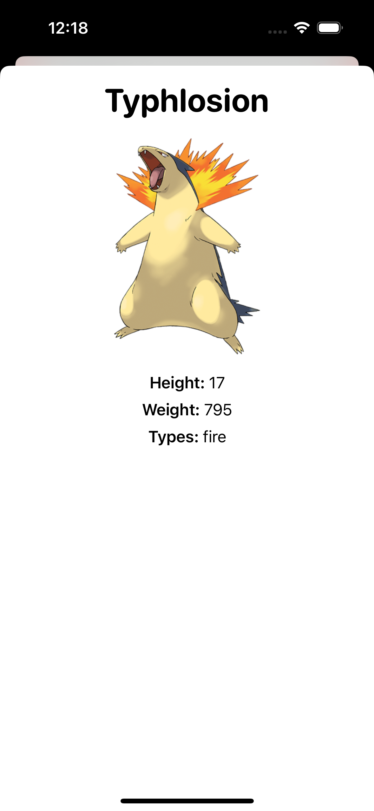

#  Pokedex SwiftUI App

A SwiftUI application that showcases a Pokedex, utilizing data fetching from PokeAPI to present detailed information about Pokémon.

## Features

- **SwiftUI Interface:** Clean and straightforward UI design for easy navigation.
- **Data Fetching:** Direct integration with PokeAPI for real-time Pokémon information.

## Screenshots

 
*Main app screen showing the list of Pokémon and detail view showing specific information about the selected Pokémon.*

## How to Use

Clone the repo, open with Xcode, and run on your preferred simulator or device.
